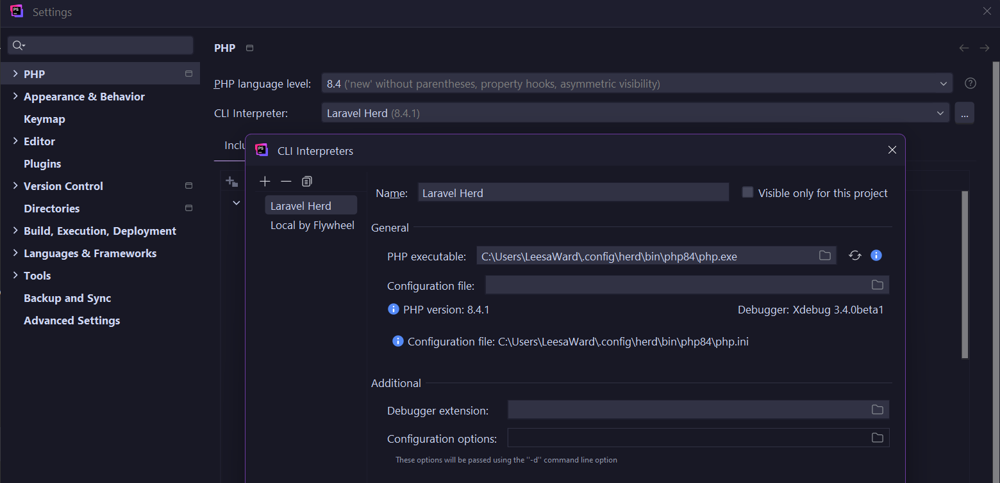

# Troubleshooting

[[toc]]

## Local development environment

::: details Where is PHP, Node, Composer, etc running from?
::: tabs#shell
@tab WSL (Bash)
```bash:no-line-numbers
readlink -f $(which php)
```
```bash:no-line-numbers
readlink -f $(which composer)
```
```bash:no-line-numbers
which node
```
```bash:no-line-numbers
which sass
```
@tab PowerShell
```powershell:no-line-numbers
Get-Command php
```
```powershell:no-line-numbers
Get-Command composer
```
```powershell:no-line-numbers
Get-Command node
```
```powershell:no-line-numbers
Get-Command sass
```
@tab PhpStorm
Settings > PHP > CLI Interpreter


Settings > PHP > Composer


If the **Composer executable** is set to just `composer` like in the above example, it is using the global Composer installation which you can find using the
terminal commands.

Settings > Languages & Frameworks > Node.js

:::

:::details Where is my PHP configuration (php.ini) file?
:warning: **Note:** The browser dev/testing envrionment run with `npm run test:server` uses its own, separate config file. Similarly if you are developing a WordPress site using Local by Flywheel, your site will use the config set by Local.

The below commands will show the configuration for your command line and/or IDE instance of PHP.
::: tabs#shell
@tab WSL (Bash)
```bash:no-line-numbers
php --ini
```
@tab PowerShell
```powershell:no-line-numbers
php --ini
```
@tab PhpStorm
1. Go to File > Settings > Languages & Frameworks > PHP > CLI Interpreter
2. Click the `...` button next to the interpreter path
3. In the dialog that appears, there will be a field to set the configuration file path. **You do not need to do this if it has automatically been detected.** Keep reading - look for the blue info icon with the configuration path below that. An example is pictured below.
   

:::

::: details "Is not a valid Win32 application" error when using a PhpStorm file watcher
If this error is occurring for an NPM package and you ran `npm install` from WSL, it may not have installed the Windows binaries in the `node_modules/.bin` directory for the tool you're trying to use. There are two workarounds:

1. Switch to PowerShell and run `npm install` again. Being a native Windows shell, it will install the Windows binaries.
2. In the file watcher configuration, set the `Program` to `node` and put the full CLI command for the tool in the `arguments` field.

If this is occurring for Sass, consider [installing Sass natively using Chocolatey](./tooling/sass.md) and setting the file watcher to use that.
:::

::: details Missing syntax highlighting in TypeScript files
Make sure the package containing definitions is listed in the root `tsconfig.json` file. For example, JS testing tools such as Playwright need to be added here for syntax highlighting to work in PhpStorm, like so:

```json
{
	"compilerOptions": {
		"types": [
			"node",
			"playwright"
		]
	}
}
```

In PhpStorm, you may also need to:
- add Playwright to the JS libraries under `Settings > Languages & Frameworks > JavaScript > Libraries`. Include all of `@playwright/test`, `playwright`, and `playwright-core`
- Uncheck "use types from server" in the TypeScript settings under `Settings > Languages & Frameworks > TypeScript`
- You may also need to restart the TypeScript service and wait a minute or so to ensure the changes take effect, and/or close and reopen any Playwright files currently open. The restart option is usually located in the bottom right of the IDE. If it's still not refreshing, try invalidating caches and restarting the IDE (`File > Invalidate Caches / Restart...`).

:::

::: details Missing Playwright browsers in Windows
In a separate PowerShell window with admin privileges:

```powershell:no-line-numbers
npx playwright install firefox
```
:::

::: details PhpStorm not detecting Xdebug when using Laravel Herd
If you are trying to use Xdebug for unit test code coverage and nothing has triggered Herd's automatic Xdebug detection, you can enable it manually:

1. Ensure the PHP version the default interpreter in PhpStorm (found in `Settings > PHP`)is set to is the same as the one currently set as the global version in Herd. In the Herd dashboard, under `Active Services` it should also say that version is active with debugging - e.g., `PHP 8.4 (debug)`
2. Back in PhpStorm > `Settings > PHP > CLI Interpreter`, click the 3 dot button to go into the interpreter details and click the `Reload PHPInfo` button
3. If it's still not picking up Xdebug, try putting the path to the extension in the `Additional` section. This will be something like `C:\Users\YOUR_USERNAME\.config\herd\bin\xdebug\xdebug-8.4.dll`. Click the reload button again, and it should pick it up if you have the file path correct.
4. In `Settings > PHP > PHP Runtime tab` and click "sync extensions with interpreter".

Below is an example of the CLI interpreter settings using this method:


Try running the unit tests with coverage again. If using the PhpStorm run configuration for PHPUnit, select "Run [test config] with coverage" as shown below:


If it works, the `Coverage` tool window should populate when the tests have finished (and coverage data should be shown in the Project tool window and in the files themselves until you close the active suite in the Coverage tool window).

Below is an example of the test run output and the coverage tool window.

[
:::

:::details print_r, var_dump, etc output not shown in the browser
If you are using the `TychoService` class to render your components, the output of `print_r`, `var_dump`, etc. will not be shown in the browser due to how the parser handles or ignores certain node types. The core package is configured to support the Symfony VarDumper, which doesn't have this problem and also has the benefit of sending the debugging output to Laravel Herd's Dumps feature if you run your project in that environment. To use:

```php
\Symfony\Component\VarDumper\VarDumper::dump($thing_you_want_to_dump);
```
:::warning
If you are running the project through Herd, the debug output will _only_ be shown in the Dumps window, and not in your browser.
:::

:::details "Class not found" errors in the browser when running through Laravel Herd
Make sure the `php.ini` file for the currently selected version of PHP in Herd contains the append and prepend values for the `wrapper_open` and `wrapper_close` files. See the [browser testing](./testing/browser.md) page for full details.

If that configuration is correct and the class is one you recently added, try running `composer dump-autoload -o` in the root or the package where you added the file. This will regenerate the autoload files and ensure that any new classes are included.
:::

## Front-end development

::: details Component JavaScript not loading in the browser
Is the script loaded either independently, or as part of the `dist.js` bundle? If not, either:

- Add a script tag (or in WordPress, `wp_enqueue_script`) to load it, remembering that you may need to put the `type="module"` attribute on the script tag
- Add the script to `rollup.index.js` and run `npm run build`
- If the script is to be included in the bundle, ensure the import path remapping in `rollup.config.js` will resolve any imports in the file correctly.

If the script is listed in `rollup.index.js` and the import path transformation seems correct, try running `npm run build` - maybe the file watcher didn't auto-compile it when expected.
:::

::: details Sass not recompiling when an imported file changes
In PhpStorm, try running "reload all from disk" to make it realise the file has changed. If that doesn't help, make a whitespace change in the file you want to recompile (not the one that's imported, that you already actually changed).

:::
