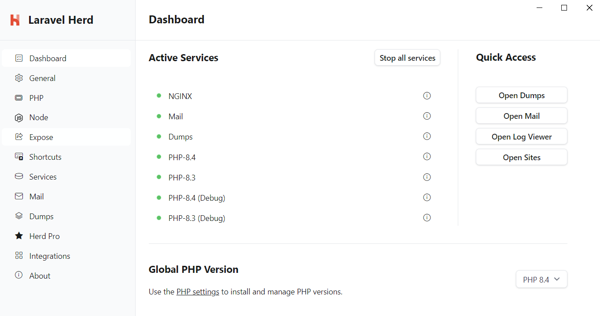

# Detailed options for local development

:::important
This is the entry point for the detailed, multi-option setup instructions I originally wrote when working out the requirements and my optimal setup and workflow for this project.

If you prefer a prescriptive, "decisions, not options" quick start guide, you can find that in the [Local Dev Quick Start](../development/setup.md) section.
:::

[[toc]]

## Prerequisites

- PHP and [Composer](https://getcomposer.org) installed locally
- [Node](https://nodejs.org) installed locally
- Git installed locally
- [Sass](https://sass-lang.com) installed globally on your machine
- IDE of choice (using [PhpStorm](https://www.jetbrains.com/phpstorm/) is documented throughout this site)

:::note
The author of Comet Components is a Windows user and [PhpStorm](https://www.jetbrains.com/phpstorm/) is her IDE of choice. While many of the instructions in this documentation and the convenience scripts provided are platform-agnostic (as she uses [WSL](https://learn.microsoft.com/en-us/windows/wsl/) which provides a Bash terminal, and many of the scripts are written in PHP or TypeScript), there are some things that developers using MacOS, Linux, and/or non-JetBrains IDEs will need to adapt for their own environments.
:::

:::tip
Windows-specific setup options and instructions are listed in the [Windows setup deep-dive](#windows-setup-deep-dive) section below.
:::

## Setup

1. Clone the repository from GitHub
2. Install dependencies and refresh Composer autoloading:

::: tabs#shell
@tab WSL (Bash)
```bash:no-line-numbers
npm run refresh:all:dev
```
@tab PowerShell
```powershell:no-line-numbers
npm run refresh:all:dev
```
:::

See the [CLI command quick reference](../development-core/cli-commands.md) for more options if you are returning to an already set up copy of the project and don't need to do a full refresh.

3. Run the [local web server](../development-core/testing/browser.md) and Storybook (`npm run storybook` from the project root) to see what you're working with!

4. Optionally, run these docs locally in dev mode:

::: tabs#shell
@tab WSL (Bash)
```bash:no-line-numbers
npm run docs
```
@tab PowerShell
```powershell:no-line-numbers
npm run docs
```
:::

## Windows setup deep-dive

::: tip
As a first step, I'd recommend installing [Chocolatey](https://community.chocolatey.org/) if you haven't already.

If you prefer to do things using a GUI where possible, you might like to use [Laravel Herd](https://herd.laravel.com/windows). If you don't have existing instances of PHP, Composer, or Node installed, the latter basically gets you up and running out-of-the-box.
:::

It is not essential to follow the steps in the below-linked guides or to use this exact setup, but this information may be helpful if you are new to any of the tools or technologies listed here, or are new to using a Windows machine for web development.

### Detailed tooling setup guides

- [PHP development setup on Windows](./tooling/php.md)
- [Node development setup on Windows](./tooling/node.md)
- <Badge type="info" text="Optional" vertical="middle" /> [PhpStorm setup](./tooling/phpstorm.md)
- <Badge type="info" text="Optional" vertical="middle" /> [WSL setup](./tooling/wsl.md)

### General notes and troubleshooting tips

::: details About the PATH system environment variable

Making things like PHP and Composer available to Windows terminals generally involves adding their directory locations to your system `path` environment variable (often referred to as `PATH` in uppercase, even though Windows 11 calls it `Path` in the GUI).

Most installation methods handle this automatically, but there may be times that you need to add, delete, or change these paths manually, such as when:
- you have multiple instances of PHP or Composer installed and your terminal aliases aren't using the one you want
- you want to use an instance that doesn't automatically get added to the PATH, or it was optional during installation and you chose not to add it

You can find the GUI for these settings in Control Panel > System > Advanced System Settings > Environment Variables. (Or just search for "environment variables" in the Start menu.)

The below example shows the path to Laravel Herd in my user PATH variable. This is the default location for PHP and Composer when installed with Herd. (You can also see that [NVM for Windows](https://github.com/coreybutler/nvm-windows) and [Local by Flywheel](https://localwp.com/)'s PHP instance are also there.)


**Note:** In some cases, these variables will be in the system PATH rather than the user PATH.

With multiple PHP instances available here, I can confirm which is being used with the terminal alias (i.e., when I type a `php` command) as per the below.

These are the same for finding Node, Composer, and other tools with a terminal alias, which is particularly useful when it's not listed specifically in the `PATH` - which is expected when Herd is controlling it (all that's in the PATH for that is `C:\Users\username\.config\herd\bin`).

::: tabs#shell
@tab WSL (Bash)
```bash:no-line-numbers
readlink -f $(which php)
```
:warning: **Warning:** WSL is not aware of the `PATH` settings unless you set up aliases to Windows executables that are. By default, it will look for instances you have installed in WSL itself.

To use the same versions as native Windows applications (such as Herd and PhpStorm) you can set up aliases to those. You can also set up aliases that go directly to specific executables, in which case it will also ignore `PATH` variables. See the [WSL setup guide](./tooling/wsl.md) for more information.

For these reasons, if you switch between WSL and PowerShell you may get different results.

@tab PowerShell
```powershell:no-line-numbers
Get-Command php
```
:warning: **Warning:** PowerShell in the PhpStorm terminal may pick up the version set as PhpStorm's CLI interpreter, rather than what you have set in your
`PATH`. There are two key PhpStorm settings that control this, which you can find in Settings > Tools > Terminal:
- Add default project PHP interpreter to PATH
- Shell integration.

If both of these are on, PowerShell will use the version set in PhpStorm and ignore anything else in your `PATH` _when used in the PhpStorm terminal_. Running a standalone PowerShell window will always use the version in your `PATH`.

| Add project interpreter to PATH | Shell integration | PowerShell behaviour within PhpStorm terminal		 |
|---------------------------------|-------------------|-------------------------------------------------|
| On                              | On                | PHP version set in PhpStorm settings            |
| On                              | Off               | System default PHP version as per `PATH`        |
| Off                             | On                | System default PHP version as per `PATH`        |
| Off                             | Off               | System default PHP version as per `PATH`        |

@tab Laravel Herd
You can see the currently selected PHP version in the Dashboard:


:warning: **Warning:** If you have other instances of PHP in your `PATH`, this might not be the one your terminal is using. Move it to the top of the list and confirm using the terminal commands.
:::

::: details Installing Playwright browsers for integration tests
::: tabs#shell
@tab WSL (Bash)
```bash:no-line-numbers
# Bash command to come
```
@tab PowerShell
```powershell:no-line-numbers
# Use a seprate PowerShell terminal with admin rights
# This will install the browsers in C:/Users/username/AppData/Local/ms-playwright
npx playwright install firefox
```
:::

See also:
- [Troubleshooting](troubleshooting.md)
