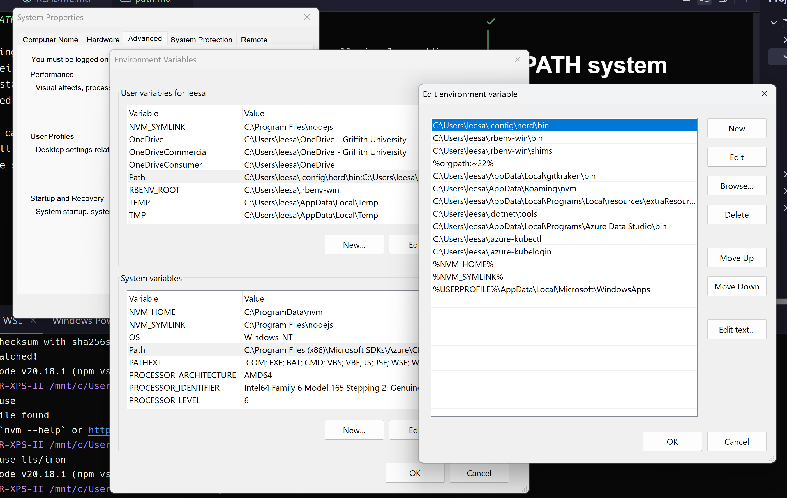

# PATH system environment variable

Making things like PHP and Composer available to Windows terminals generally involves adding their directory locations to your system `path` environment variable (often referred to as `PATH` in uppercase, even though Windows 11 calls it `Path` in the GUI).

Most installation methods handle this automatically, but there may be times that you need to add, delete, or change these paths manually, such as when:
- you have multiple instances of PHP or Composer installed and your terminal aliases aren't using the one you want
- you want to use an instance that doesn't automatically get added to the PATH, or it was optional during installation and you chose not to add it

You can find the GUI for these settings in Control Panel > System > Advanced System Settings > Environment Variables. (Or just search for "environment variables" in the start menu.)

The below example shows the path to Laravel Herd in my user PATH variable. This is the default location for PHP and Composer when installed with Herd. (You can also see that [NVM for Windows](https://github.com/coreybutler/nvm-windows) and [Local by Flywheel](https://localwp.com/)'s PHP instance are also there.) 



Note: In some cases, these variables will be in the system PATH rather than the user PATH. 

With multiple PHP instances available here, I can confirm which is being used with the terminal alias in PowerShell like so: 

```PowerShell
Get-Command php
```
```PowerShell
Get-Command composer
```
```PowerShell
Get-Command node
```
