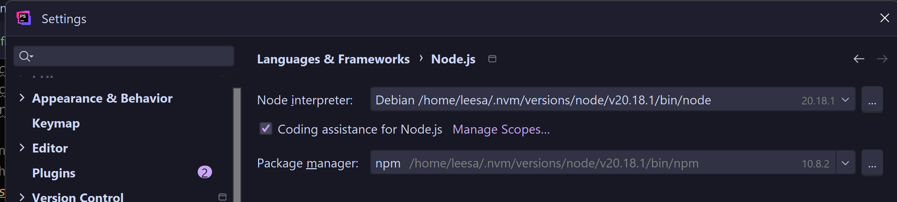

# My PhpStorm setup

> [!TIP]
> Ensure you have [PHP](./php.md) and [Node](./node.md) set up locally before continuing.

1. [PHP interpreter](#php-interpreter)
2. [Xdebug](#xdebug)
3. [PHPUnit](#phpunit)
4. [Node](#node)
5. [File watchers](#file-watchers)
    - [SASS](#sass)
    - [Rollup](#rollup)
    - [Blade Formatter](#blade-formatter)
6. [Linting and formatting](#linting-and-formatting)
    - [PHP - PhpStorm code style settings](#php---phpstorm-formatting)
    - [JavaScript and TypeScript - ESLint](#javascript-and-typescript---eslint)

---

## PHP interpreter

For IDE tools such as the PHPUnit test runner and Xdebug integration to work, you will need to set the PHP interpreter
and language version. For consistency, usually this should be the same as the PHP instance you are using in your
terminal.

You can find these settings in PhpStorm under `File > Settings > Languages & Frameworks > PHP`. If your PHP instance is
not listed, click the 3 dots next to the dropdown and add it.

Below is an example of adding Laravel Herd's PHP 8.4 instance:

Generally, it should pick up the configuration file (`php.ini`) automatically, but if you have some custom setup or
problems with that you can set the path to your preferred file in the field provided in this dialog.

---

## Xdebug

If you have Xdebug installed and enabled in your PHP instance, PhpStorm will use it for debugging and code coverage. You
can check if it is available in the interpreter settings as per the above.

---

## PHPUnit

Configuration of PHPUnit is mostly handled in its configuration file (`./test/phpunit.xml`). You can check and tweak the
settings for PhpStorm under `File > Settings > Languages & Frameworks > PHP > Test Frameworks`.

---

## Node

Ensure that PhpStorm's default Node interpreter matches the one you are using in your terminal. If this is not set
correctly, tools like ESLint won't work in the editor and you may experience inconsistent or unexpected behaviour when
switching between doing tasks in the terminal and the IDE.

You can find the setting for this in Settings > Languages & Frameworks > Node.js.

---

## File watchers

**Note:** These configurations are included in this repository (`.idea/watcherTasks.xml`) so it _should_ all be there
already.

### SASS

If you have installed Sass globally on your machine, you can set up a file watcher in PhpStorm to compile your SCSS to
matching CSS files. This is particularly useful if using pure Dart Sass installed via Chocolatey in Windows. (Also, it's
just neat to not have to run a command at all.)

PhpStorm will probably prompt you to set up a file watcher when you open a `.scss` file for the first time, but you can
also find the configuration in `File > Settings > Tools > File Watchers`. An example config looks like this:

At the time of writing this, I have two SCSS watchers set up:

1. To compile the core package's individual components' SCSS files to CSS files in the same directory
2. To compile the `blocks.scss` file in the WordPress plugin package, which imports files from the core package; the
   watcher also watches those.

The difference between the two is that the core one is scoped to a custom scope of just that package folder (you can
create this under "Files to watch -> Scope -> click the 3 dots), whereas the WordPress plugin one is scoped to the
entire project so that the core package's files are also watched.

### Rollup

If you are working on the core package, you can set up a file watcher to bundle the component JS files into a single
file automatically on save.

In `File > Settings > Tools > File Watchers`:

Note: If you add a new JS file, you need to add it to `rollup.index.js` so that Rollup knows to include it in the
bundle.

### Blade Formatter

If you are working on the core package (or an implementation where you are overriding Blade templates) you can set up a
file watcher to format Blade templates on save using [blade-formatter](https://github.com/shufo/blade-formatter).
Configuration for this is included in the `core` package directory.

In `File > Settings > Tools > File Watchers`:

**Important:** Ensure you exclude Blade files from PhpStorm's built-in reformatting, as it will cause conflicts. By
default, Blade templates will adopt the HTML code style settings, which might not match what you want for Blade due to
how it treats @directives as HTML attributes. You can find the setting to exclude Blade files in
`File -> Settings -> Editor -> Code Style`. Click Code Style itself at the top level, and then the `Formatter` tab.

---

## Linting and formatting

### PHP - PhpStorm formatting

I tend to use PhpStorm's built in formatting options for PHP (mainly because I used them long before I started working
with
JavaScript regularly and had no need or desire to use a separate formatting tool)[^1]. You can find these settings in
`File > Settings > Editor > Code Style > PHP`.

You can enable enforcing formatting rules on save in `File > Settings > Tools > Actions on save` by ticking the "
Reformat code" option.

> [!IMPORTANT]
> Ensure JavaScript and TypeScript are not ticked in the list of file types to reformat on save, to avoid conflicts with
> ESLint.

I include my PhpStorm project config files in this repository for my own convenience, so the same formatting settings
should be available (as the "Project" settings) to you if you are using PhpStorm.

[^1]: There is a [Prettier plugin for PHP](https://github.com/prettier/plugin-php) that I have used for
particular purposes, but I have not included it in this project at the time of writing for a few reasons:

- PhpStorm's options meet my needs so why add another dependency
- I don't want to use Prettier for JavaScript - I prefer ESLint's options and don't want to double up on formatting
  tools
- It doesn't cover all the formatting options I use in PhpStorm, so I'd end up using both which could cause conflicts.

### JavaScript and TypeScript - ESLint

I use [ESLint](https://eslint.org/) for linting and formatting JavaScript and TypeScript code. You can enable ESLint to
pick up problems within the IDE as well as fix them automatically on save in
`File > Settings > Languages & Frameworks > JavaScript > Code Quality Tools > ESLint`.

It _should_ pick up the configuration file located in the root of the project (`./.eslint.config.js`), but you can set
the path to your configuration manually if necessary or preferred.

---
