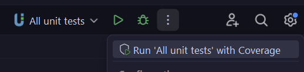

# Testing

- [General information](#general-information)
- [Storybook](#storybook)
- [Unit testing](#unit-testing)
    - [Running tests](#running-tests)
    - [About the setup](#about-the-setup)
    - [Useful links](#useful-links)
- [Component testing](#component-testing)
- [Visual regression testing](#visual-regression-testing)

---

## General information

> [!NOTE]
> When testing compatibility of Comet Components with WordPress core block output, it is important to know that the
> tests are designed to cover only the attributes I generally support in my themes and will be supporting in the Comet
> Components WordPress plugin (the plugin will disable attributes in the editor if they are not supported).
>
> A related note-to-self about this: If looking to refer to WP core `block.json` files for automating test boilerplate
> and for checking coverage, this will need to be accounted for somehow.

---

### Storybook

// TODO.

---

## Unit testing

### Running tests

To run a test file from the terminal:

```bash
./vendor/bin/phpunit  test/unit/HeadingTest.php --configuration ./test/phpunit.xml
```

PHPStorm users can:

- Use the included Run configuration to run all tests
- Run selected tests or files from the gutter icon; A PHPUnit run config template has also been included which will be
  used for that unless you configure otherwise.

See [PHPStorm configuration notes](./phpstorm.md) for more information.

### Coverage reporting

You will need [Xdebug](https://xdebug.org/) installed and enabled to generate coverage data and reports. See
the [PHP setup notes](./php.md) for more information.

A PHPStorm Run Configuration has been included in this repository for running all tests and generating HTML coverage
report. To see coverage data using the IDE coverage tools, use the "Run with coverage" option. By default, this is
located in the top right corner of the PHPStorm window (shown below); you can also find it in the Run menu.

]

### About the setup

> [!WARNING]
> The unit tests are set up to use PHPUnit with BrainMonkey, which provides Patchwork and Mockery under the hood with
> convenience functions for mocking, and a bunch of WordPress-specific stuff. The catch is version compatibility
> problems.
> At the time of writing, the latest version of BrainMonkey is 2.6.2 and it is compatible with PHPUnit 9.x. **Newer
versions
> of PHPUnit experience silent failures.** You can find the latest compatibility information
> on [Packagist](https://packagist.org/packages/brain/monkey). Patchwork + PHPUnit compatibility is also something to
> watch out for in the future.

#### Test class hierarchy example

| Class              | Inherits from                | Purpose                                                                                                      |
|--------------------|------------------------------|--------------------------------------------------------------------------------------------------------------|
| `HeadingTest.php`  | `WpBridgeTestCase`           | Unit tests for the Heading component                                                                         |
| `WpBridgeTestCase` | `CometTestCase`              | Sets up the minimum required WordPress code to test compatibility of Comet Components with WordPress blocks. |
| `CometTestCase`    | `PHPUnit\Framework\TestCase` | Common setup for all tests, such as initialising support libraries.                                          |

Unit tests should generally inherit from either `CometTestCase` or `WpBridgeTestCase` (the latter being for testing
integration with WordPress blocks). In the future there will probably be additional second-layer test classes for other
PHP systems. The exception is things that do not require any function mocks.

### Useful links

- [Troubleshooting notes](./troubleshooting.md)
- [PHPUnit 9.6 docs](https://docs.phpunit.de/en/9.6/)
- [BrainMonkey docs](https://giuseppe-mazzapica.gitbook.io/brain-monkey)

---

## Component testing

// TODO.

---

## Visual regression testing

// TODO.

---
