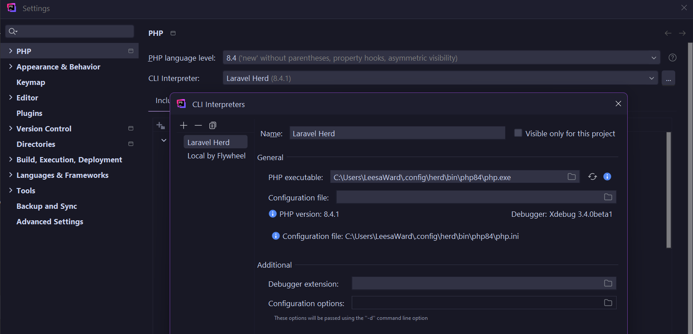

# PHP development setup on Windows

- [Local PHP installation](#local-php-installation)
  - [Install via PowerShell with Chocolatey](#install-via-powershell-with-chocolatey)
  - [Install with Laravel Herd](#install-with-laravel-herd)
  - [Confirm PHP alias is available](#confirm-php-alias-is-available)
  - [Optional] [Use Windows' PHP in WSL](#optional-use-windows-php-in-wsl)
- [Composer](#composer)
  - [Install via PowerShell with Chocolatey](#install-via-powershell-with-chocolatey-1)
  - [Install with Laravel Herd](#install-with-laravel-herd-1)
  - [Confirm Composer alias is available](#confirm-composer-alias-is-available)
  - [Optional] [Use Windows' Composer in WSL](#optional-use-windows-composer-in-wsl)
- [Checking and changing instances](#checking-and-changing-instances)
  - [Which instance is being used?](#which-instance-is-being-used)
  - [Changing the PHP or Composer instance](#changing-the-php-or-composer-instance)
- [Optional] [PHPStorm Configuration](#optional-phpstorm-configuration)

---
## Local PHP installation

You can install PHP in Windows a number of ways, including:
1. Downloading a zip from [php.net](https://www.php.net/downloads) and extracting it where you want it to live (quickest and easiest in the short term, but not great for updates)
2. Using the [Chocolatey](https://community.chocolatey.org/) package manager through PowerShell 
3. Installing [Laravel Herd](https://herd.laravel.com/windows), a GUI which includes PHP and Composer and puts them in your [system PATH](./path.md) automatically 
4. For WordPress development, using [Local by Flywheel](https://localwp.com/) and making its PHP instance available to your terminal of choice[^2]
5. Using local web server software like [XAMPP](https://www.apachefriends.org/index.html) or [WampServer](https://www.wampserver.com/en/) and making its PHP instance available to your terminal of choice[^2].

### Install via PowerShell with Chocolatey

```PowerShell
# Standard - installs in C:/tools by default
choco install php 
```
To update:
```PowerShell
choco upgrade php
```
### Install with Laravel Herd

Download and install [Laravel Herd](https://herd.laravel.com/windows). It comes with PHP and Composer built in, and makes it very easy to have multiple PHP versions installed and switch between them - no need to change environment variables or even type a terminal command.

### Confirm PHP alias is available

In PowerShell: 
```PowerShell
php -v
```
If this doesn't show a PHP version, you may just need to manually [add PHP to your PATH](./path.md).

### [Optional] Use Windows' PHP in WSL

I use WSL for most of my day-to-day CLI needs. You can install PHP within the Linux environment, but I opt to use the Windows PHP installation[^1] - which you can access from WSL by creating a symbolic link.

To remove previous symlink:

```bash
sudo rm /usr/local/bin/php
```

For a symlink to specific PHP version, use one of the following from a WSL terminal as relevant to your setup:
```bash
# For PHP 8.4 in the Chocolatey default location
sudo ln -s /mnt/c/tools/php84/php.exe /usr/local/bin/php
```
```bash
# For PHP 8.4 from Laravel Herd (replace leesa with your Windows username)
sudo ln -s /mnt/c/Users/leesa/.config/herd/bin/php84/php.exe /usr/local/bin/php
```
```bash
# For PHP 8.3 from Local by Flywheel  (replace leesa with your Windows username)
sudo ln -s /mnt/c/Users/leesa/AppData/Local/Programs/Local/resources/extraResources/lightning-services/php-8.3.0+0/bin/win64/php.exe /usr/local/bin/php
```

For any of these, the command to confirm it works and see the version is:
```bash
php -v
```

To change which instance of PHP is used, remove the existing symlink first:
```bash
sudo rm /usr/local/bin/php
```
---

## Composer

Composer is a dependency manager for PHP. You can install it in a number of ways, such as:
- Downloading and running the [Windows installer](https://getcomposer.org/download/) from the Compser website
- Via Chocolatey in PowerShell
- By installing [Laravel Herd](https://herd.laravel.com/windows), which comes with Composer built-in. 

### Install via PowerShell with Chocolatey

```PowerShell
choco install composer
```
To update:
```PowerShell
choco upgrade composer
```

### Install with Laravel Herd

Download and install [Laravel Herd](https://herd.laravel.com/windows). It comes with PHP and Composer built in.

### Confirm Composer alias is available

Once installed, confirm that it works in PowerShell:
```PowerShell
composer -v
```
If it isn't, you probably just need to manually add the path to composer in your [PATH system environment variable](./path.md).

### [Optional] Use Windows' Composer in WSL

If using Windows' PHP as explained above, Composer can then be used from WSL by adding an alias to your Bash config (`.bashrc` or `.zshrc`) like so: 

```bash
# /home/leesa/.zshrc
alias composer='powershell.exe /c C:\\Users\\leesa\\.config\\herd\\bin\\composer.bat'
```
As you can see from it starting with `powershell.exe`, this effectively makes WSL a wrapper and the command is actually executed by PowerShell. This makes no real difference in practice, but it's nice to not have to switch terminals. 

Restart the WSL terminal and then confirm it works:
```bash
composer -v
```

---
## Checking and changing instances

### Which instance is being used?

At any time, you can confirm where the PHP and Composer aliases resolve to with the following commands in WSL:

```bash
readlink -f $(which php)
```
```bash
which composer
```

Or in PowerShell: 
```PowerShell
Get-Command php
```
```PowerShell
Get-Command composer
```

### Changing the PHP or Composer instance

To change these, I find it easiest to modify the [system PATH variables](./path.md) in the Windows GUI, but there's probably some aliasing you could do instead. 

Once PowerShell is pointing to the instance you want, you will need to update the WSL symlink (for PHP) or alias (for Composer) accordingly.

---
## [Optional] PHPStorm Configuration

For IDE tools such as the PHPUnit test runner to work, you will need to set the PHP interpreter and language version. For consistency, usually this should be the same as the PHP instance you are using in your terminal.

You can find these settings in PHPStorm under `File > Settings > Languages & Frameworks > PHP`. If your PHP instance is not listed, click the 3 dots next to the dropdown and add it. 

Below is an example of adding Laravel Herd's PHP 8.4 instance:



Generally, it should pick up the configuration file (`php.ini`) automatically. 


---
[^1]: Why do I do that, you ask? It's easier for using the same PHP instance across many tools. I can also update this alias to use the instance provided by tools such as Laravel Herd or Local by Flywheel when appropriate.
